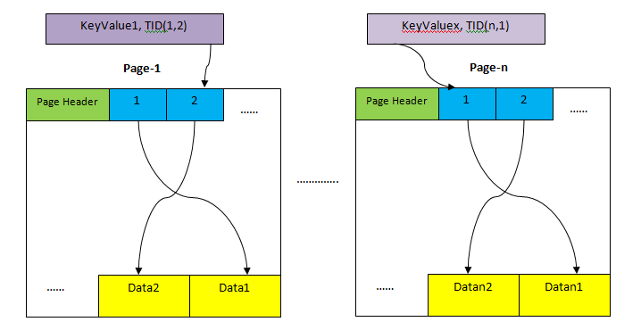

# Basics: PostgreSQL filesystem

* PostgreSQL is a disk-oriented database, which means its data are stored on disks in pages. A access to heap page can
  be random or sequential, where a random access costs roughly ~4times more expensive than a sequential access.
* PostgreSQL is row-based, which means all columns of a tuple is stored on the same page. To address the issue of
  vairable-length data, tuples data are stored from back to beginning while their pointers are stored from beginning to
  back in a heap page. 
* Indexes are stored on separate pages. An entry of index table consists of (key value, TID of corresponding tuple).
* Tuple Identifier (TID) is used to record the unique location of a tuple. It is 6-byte long and consists of two parts: 
  4-byte-long page number and 4-byte-long index number inside the page.

# Scan Methods
* **Sequential Scan**
    * Iterate through the table sequentially and return tuples that matches predicate one at a time.
    * Cost is computed based on seq_page_cost * no. of pages.
    * Ideal for high-selectivity operations.
* **Index Scan**
    * Get the TID of tuples that match the predicate, access corresponding heap pages to get the tuple.
    * Cost is computed based on 2 * random_page_cost (index + heap).
    * Ideal for low-selectivity operations.
* **Index Only Scan**
    * Similar to index scan but no need to access heap pages because only the column with index is required to emit.
    * Example: select num from table where num=1;
* **Bitmap Scan**
    * Mix-up of index scan and sequential scan. Read all indexes to create a bitmap of tuple TIDs
* **TID Scan**

# Join Methods

* **Nested Loop Join**
* **Merge Join**
* **Hash Join**
